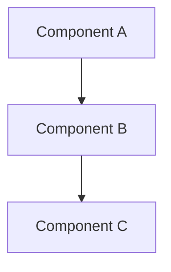
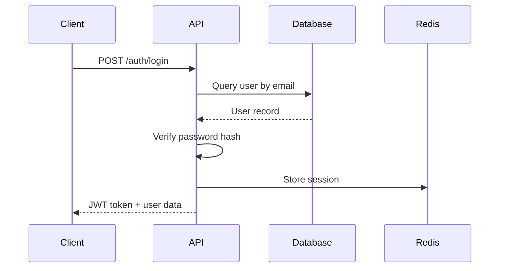

# Kiro IDE - Specs Configuration Guide

Spec-driven development workflow through structured markdown files that guide implementation from requirements to completion.

## Overview

Specs in Kiro IDE provide a structured approach to software development by breaking features into three distinct phases: requirements definition, design documentation, and task execution. Each spec lives in its own directory within `.kiro/specs/` and contains three markdown files that guide development from concept to implementation.

## What are Specs?

Specs are a formalized approach to feature development that ensures:
- **Clear requirements** - Documented user stories and acceptance criteria
- **Thoughtful design** - Architectural decisions before implementation
- **Incremental execution** - Step-by-step task breakdown with validation
- **Version control** - Complete feature history in your repository
- **Team alignment** - Shared understanding of what's being built and why

**Benefits:**
- Reduced miscommunication and rework
- Better architectural decisions
- Incremental, testable progress
- Complete feature documentation
- Easier onboarding for new team members

## Configuration Location

**Directory:** `.kiro/specs/{feature-name}/`

Each feature gets its own directory containing three required files:
- `requirements.md` - What needs to be built
- `design.md` - How it will be built
- `tasks.md` - Step-by-step implementation checklist

## File Structure

```
project/
└── .kiro/
    └── specs/
        ├── user-authentication/
        │   ├── requirements.md
        │   ├── design.md
        │   └── tasks.md
        ├── payment-integration/
        │   ├── requirements.md
        │   ├── design.md
        │   └── tasks.md
        └── dashboard-redesign/
            ├── requirements.md
            ├── design.md
            └── tasks.md
```

## Workflow

Kiro IDE supports a three-phase workflow for spec-driven development:

```
1. Requirements → 2. Design → 3. Tasks → 4. Implementation
      ↓               ↓           ↓            ↓
   Define what    Plan how    Break down   Execute and
   to build       to build    into steps    validate
```

### Phase 1: Requirements Definition

Define **what** needs to be built through user stories and acceptance criteria.

### Phase 2: Design Documentation

Document **how** the feature will be built with architecture, components, and technical decisions.

### Phase 3: Task Breakdown

Create **actionable steps** for implementation with clear, testable objectives.

### Phase 4: Implementation

Execute tasks incrementally, validating each step against requirements and design.

---

## Requirements File (requirements.md)

### Purpose

Captures the feature's purpose, user needs, and acceptance criteria using structured formats.

### Structure

```markdown
# Feature Name

## Introduction

Brief overview of the feature and its purpose.

## User Stories

As a [user type], I want [goal] so that [benefit].

### User Story 1: [Title]
**As a** [user type]
**I want** [goal]
**So that** [benefit]

**Acceptance Criteria:**
- [ ] Criterion 1
- [ ] Criterion 2

## Requirements

### Functional Requirements

**REQ-001: [Requirement Title]**
- **EARS Notation**: When [optional trigger], if [optional precondition], the system shall [system response]
- **Priority**: High/Medium/Low
- **Rationale**: Explanation of why this requirement exists

**REQ-002: [Another Requirement]**
...

### Non-Functional Requirements

**NFR-001: [Performance Requirement]**
- **EARS Notation**: Where [feature], the system shall [performance metric]
- **Acceptance**: Specific measurement criteria

### Edge Cases and Constraints

- Edge case 1
- Edge case 2
- Constraint 1
```

### EARS Notation

**Easy Approach to Requirements Syntax** provides structured acceptance criteria:

**Ubiquitous (always active):**
```
The system shall [system response]
Example: The system shall encrypt all user passwords
```

**Event-driven:**
```
When [trigger], the system shall [system response]
Example: When user clicks "Submit", the system shall validate form data
```

**State-driven:**
```
While [in state], the system shall [system response]
Example: While user is authenticated, the system shall display logout button
```

**Optional features:**
```
Where [feature is included], the system shall [system response]
Example: Where dark mode is enabled, the system shall use dark color scheme
```

**Conditional:**
```
If [condition], then the system shall [system response]
Example: If password is incorrect, then the system shall display error message
```

### Example: User Authentication Requirements

```markdown
# User Authentication

## Introduction

Implement secure user authentication with email/password login, session management, and password reset capabilities.

## User Stories

### User Story 1: Email and Password Login
**As a** registered user
**I want** to log in with my email and password
**So that** I can access my account

**Acceptance Criteria:**
- [ ] User can enter email and password
- [ ] System validates credentials against database
- [ ] Successful login redirects to dashboard
- [ ] Failed login shows clear error message
- [ ] Account locks after 5 failed attempts

### User Story 2: Password Reset
**As a** user who forgot their password
**I want** to reset my password via email
**So that** I can regain access to my account

**Acceptance Criteria:**
- [ ] User can request password reset
- [ ] System sends reset link to registered email
- [ ] Reset link expires after 1 hour
- [ ] User can set new password through link

## Requirements

### Functional Requirements

**REQ-001: User Login**
- **EARS Notation**: When user submits login form, if credentials match database record, the system shall create authenticated session
- **Priority**: High
- **Rationale**: Core authentication functionality

**REQ-002: Password Hashing**
- **EARS Notation**: The system shall hash all passwords using bcrypt with salt rounds of 12
- **Priority**: High
- **Rationale**: Security best practice for password storage

**REQ-003: Session Management**
- **EARS Notation**: While user is authenticated, the system shall maintain session token in httpOnly cookie
- **Priority**: High
- **Rationale**: Secure session management prevents XSS attacks

**REQ-004: Failed Login Attempts**
- **EARS Notation**: When user fails login 5 times, the system shall lock account for 15 minutes
- **Priority**: Medium
- **Rationale**: Prevents brute force attacks

**REQ-005: Password Reset Email**
- **EARS Notation**: When user requests password reset, if email exists in database, the system shall send reset link
- **Priority**: High
- **Rationale**: Enables account recovery

### Non-Functional Requirements

**NFR-001: Login Performance**
- **EARS Notation**: Where user submits login form, the system shall respond within 2 seconds
- **Acceptance**: 95th percentile response time under 2s

**NFR-002: Password Security**
- **EARS Notation**: The system shall enforce minimum 8 characters with uppercase, lowercase, number, and symbol
- **Acceptance**: Password validation rejects non-compliant passwords

### Edge Cases and Constraints

- Email addresses are case-insensitive
- Whitespace in email/password is trimmed
- Password reset link works only once
- Concurrent login attempts from same IP are rate-limited
- System maintains audit log of all authentication events
```

---

## Design File (design.md)

### Purpose

Documents architectural decisions, technical approach, and implementation details before coding begins.

### Structure

```markdown
# Feature Name - Design

## Overview

High-level summary of the technical approach.

## Architecture

System components and their interactions (include diagrams).

### Component Diagram


## Components

### Component 1: [Name]
- **Responsibility**: What this component does
- **Technology**: Libraries/frameworks used
- **Location**: File/directory path

### Component 2: [Name]
...

## Data Models

### Model 1: [Entity Name]
```typescript
interface User {
  id: string;
  email: string;
  passwordHash: string;
  createdAt: Date;
}
```

**Schema Details:**
- Field descriptions
- Validation rules
- Relationships

## API Endpoints

### POST /auth/login
**Description**: Authenticate user and create session

**Request:**
```json
{
  "email": "user@example.com",
  "password": "SecurePass123!"
}
```

**Response (200):**
```json
{
  "user": { "id": "123", "email": "user@example.com" },
  "token": "jwt-token-here"
}
```

**Error Responses:**
- 400: Invalid input
- 401: Invalid credentials
- 429: Too many attempts

## Security Considerations

- Authentication approach
- Data encryption
- Input validation
- Authorization checks

## Error Handling

- Error types and codes
- User-facing messages
- Logging strategy

## Testing Strategy

- Unit tests
- Integration tests
- E2E tests
- Test data approach

## Implementation Notes

- Third-party dependencies
- Performance optimizations
- Deployment considerations
```

### Example: User Authentication Design

```markdown
# User Authentication - Design

## Overview

Implement JWT-based authentication with bcrypt password hashing, using Express middleware for route protection and Redis for session management.

## Architecture

### System Flow


## Components

### Component 1: Authentication Controller
- **Responsibility**: Handle login, logout, password reset requests
- **Technology**: Express.js, express-validator
- **Location**: `src/controllers/authController.ts`

### Component 2: Password Service
- **Responsibility**: Hash passwords, verify credentials
- **Technology**: bcrypt
- **Location**: `src/services/passwordService.ts`

### Component 3: JWT Service
- **Responsibility**: Generate and validate JWT tokens
- **Technology**: jsonwebtoken
- **Location**: `src/services/jwtService.ts`

### Component 4: Session Store
- **Responsibility**: Persist active sessions
- **Technology**: Redis, ioredis client
- **Location**: `src/services/sessionService.ts`

## Data Models

### User Model
```typescript
interface User {
  id: string;              // UUID
  email: string;           // Unique, lowercase
  passwordHash: string;    // Bcrypt hash
  failedAttempts: number;  // Login failure counter
  lockedUntil: Date | null; // Account lock timestamp
  createdAt: Date;
  updatedAt: Date;
}
```

**Database Table:**
```sql
CREATE TABLE users (
  id UUID PRIMARY KEY DEFAULT uuid_generate_v4(),
  email VARCHAR(255) UNIQUE NOT NULL,
  password_hash VARCHAR(255) NOT NULL,
  failed_attempts INTEGER DEFAULT 0,
  locked_until TIMESTAMP NULL,
  created_at TIMESTAMP DEFAULT NOW(),
  updated_at TIMESTAMP DEFAULT NOW()
);

CREATE INDEX idx_users_email ON users(email);
```

### Session Model
```typescript
interface Session {
  userId: string;
  token: string;
  expiresAt: Date;
  createdAt: Date;
}
```

**Redis Storage:**
```
Key: session:{userId}
Value: JSON.stringify({ token, expiresAt })
TTL: 1 hour
```

## API Endpoints

### POST /api/auth/login
**Description**: Authenticate user credentials and issue JWT

**Request:**
```json
{
  "email": "user@example.com",
  "password": "SecurePass123!"
}
```

**Response (200):**
```json
{
  "user": {
    "id": "550e8400-e29b-41d4-a716-446655440000",
    "email": "user@example.com"
  },
  "token": "eyJhbGciOiJIUzI1NiIsInR5cCI6IkpXVCJ9..."
}
```

**Error Responses:**
- 400: Missing or invalid email/password format
- 401: Invalid credentials
- 423: Account locked (too many attempts)
- 429: Rate limit exceeded

### POST /api/auth/logout
**Description**: Invalidate user session

**Headers:**
```
Authorization: Bearer {token}
```

**Response (200):**
```json
{
  "message": "Logged out successfully"
}
```

### POST /api/auth/reset-password-request
**Description**: Send password reset email

**Request:**
```json
{
  "email": "user@example.com"
}
```

**Response (200):**
```json
{
  "message": "If the email exists, a reset link has been sent"
}
```

**Note:** Always returns 200 to prevent email enumeration

### POST /api/auth/reset-password
**Description**: Set new password using reset token

**Request:**
```json
{
  "token": "reset-token-from-email",
  "newPassword": "NewSecurePass456!"
}
```

**Response (200):**
```json
{
  "message": "Password reset successfully"
}
```

**Error Responses:**
- 400: Invalid or expired token
- 422: Password does not meet requirements

## Security Considerations

### Password Storage
- Bcrypt with 12 salt rounds
- Never store plaintext passwords
- Hash comparison in constant time

### JWT Implementation
- HS256 algorithm with 256-bit secret
- 1-hour expiration
- Include user ID and issued-at timestamp
- Validate signature on every request

### Rate Limiting
- 5 login attempts per IP per 15 minutes
- 3 password reset requests per email per hour
- Implement exponential backoff for repeated failures

### Session Management
- HttpOnly cookies prevent XSS access
- Secure flag in production (HTTPS only)
- SameSite=Strict prevents CSRF
- Redis TTL auto-expires sessions

### Input Validation
- Email: RFC 5322 compliant, max 255 chars
- Password: Min 8 chars, 1 uppercase, 1 lowercase, 1 number, 1 symbol
- Sanitize all inputs before database queries

## Error Handling

### Authentication Errors
```typescript
class AuthenticationError extends Error {
  statusCode = 401;
  code = 'AUTH_FAILED';
  message = 'Invalid email or password';
}

class AccountLockedError extends Error {
  statusCode = 423;
  code = 'ACCOUNT_LOCKED';
  message = 'Account locked due to too many failed attempts';
  lockedUntil: Date;
}
```

### Logging
- Log all authentication attempts (success and failure)
- Include timestamp, IP address, user agent
- Mask sensitive data (passwords, tokens)
- Alert on suspicious patterns (distributed attacks)

## Testing Strategy

### Unit Tests
- Password hashing and verification
- JWT generation and validation
- Session creation and expiration
- Input validation rules

### Integration Tests
- Login flow with valid credentials
- Login flow with invalid credentials
- Account locking after failed attempts
- Password reset email delivery
- Session persistence in Redis

### E2E Tests
- Complete user registration and login
- Password reset journey
- Session expiration and re-authentication
- Concurrent session handling

### Test Data
```typescript
const mockUsers = [
  {
    email: 'test@example.com',
    password: 'TestPass123!',
    passwordHash: await bcrypt.hash('TestPass123!', 12)
  }
];
```

## Implementation Notes

### Dependencies
```json
{
  "bcrypt": "^5.1.0",
  "jsonwebtoken": "^9.0.0",
  "express-validator": "^7.0.0",
  "ioredis": "^5.3.0",
  "nodemailer": "^6.9.0"
}
```

### Environment Variables
```env
JWT_SECRET=your-256-bit-secret
JWT_EXPIRATION=1h
REDIS_URL=redis://localhost:6379
BCRYPT_ROUNDS=12
RATE_LIMIT_WINDOW=15m
MAX_LOGIN_ATTEMPTS=5
```

### Performance Optimizations
- Redis connection pooling
- Database query optimization with indexes
- Async password hashing to prevent blocking
- CDN for static assets

### Deployment Considerations
- Environment-specific configs (dev/staging/prod)
- Secret rotation strategy
- Database migration scripts
- Health check endpoint for session store
```

---

## Tasks File (tasks.md)

### Purpose

Breaks down design into incremental, testable implementation steps that can be executed one at a time.

### Structure

```markdown
# Feature Name - Tasks

Implementation checklist for [feature name] organized by component.

## Prerequisites

- [ ] Environment setup
- [ ] Dependencies installed
- [ ] Database migrations ready

## Component 1: [Name]

### Task 1.1: [Specific Objective]
**Objective**: Brief description of what to build

**Requirements**: REQ-001, REQ-002

**Implementation:**
- Create file at `path/to/file.ts`
- Implement function with signature: `functionName(params): ReturnType`
- Handle edge cases: case1, case2

**Validation:**
- [ ] Unit tests pass
- [ ] Code meets requirements
- [ ] No linting errors

---

### Task 1.2: [Next Objective]
...

## Component 2: [Name]

### Task 2.1: [Objective]
...

## Integration

### Task INT-1: Connect Components
...

## Testing

### Task TEST-1: Integration Tests
...

### Task TEST-2: E2E Tests
...

## Documentation

### Task DOC-1: Update README
...
```

### Best Practices for Tasks

**Each task should:**
- Be completable in 30-60 minutes
- Have clear acceptance criteria
- Reference specific requirements
- Include validation steps
- Be independently testable
- Build incrementally on previous tasks

**Task naming:**
- Use descriptive titles: "Create user login endpoint" not "Task 1"
- Include component prefix: "AUTH-1", "DB-1", "UI-1"
- Order logically: dependencies first

**Validation criteria:**
- Specific test outcomes
- Code quality checks
- Requirement verification
- No placeholders or TODOs

### Example: User Authentication Tasks

```markdown
# User Authentication - Tasks

Implementation checklist for user authentication feature.

## Prerequisites

- [ ] PostgreSQL database configured
- [ ] Redis instance running
- [ ] Environment variables set
- [ ] Dependencies installed: bcrypt, jsonwebtoken, express-validator, ioredis

## Component 1: Database Schema

### Task DB-1: Create Users Table
**Objective**: Set up PostgreSQL users table with authentication fields

**Requirements**: REQ-001, REQ-002, REQ-004

**Implementation:**
- Create migration file: `migrations/001_create_users_table.sql`
- Define schema with fields: id (UUID), email (unique), password_hash, failed_attempts, locked_until, timestamps
- Add index on email column
- Run migration against database

**Validation:**
- [ ] Migration executes without errors
- [ ] Table structure matches design specification
- [ ] Email index exists: `\d users` shows index
- [ ] Can insert and query test records

---

### Task DB-2: Create Password Reset Tokens Table
**Objective**: Store password reset tokens with expiration

**Requirements**: REQ-005

**Implementation:**
- Create migration file: `migrations/002_create_password_reset_tokens.sql`
- Define schema: id (UUID), user_id (FK), token (unique), expires_at, created_at
- Add index on token column
- Add foreign key constraint to users table

**Validation:**
- [ ] Migration executes successfully
- [ ] Foreign key relationship works
- [ ] Token uniqueness enforced
- [ ] Can query tokens by user_id

---

## Component 2: Password Service

### Task AUTH-1: Implement Password Hashing
**Objective**: Create service for hashing and verifying passwords with bcrypt

**Requirements**: REQ-002

**Implementation:**
- Create file: `src/services/passwordService.ts`
- Implement `hashPassword(plaintext: string): Promise<string>` using bcrypt with 12 rounds
- Implement `verifyPassword(plaintext: string, hash: string): Promise<boolean>` using bcrypt.compare
- Handle errors with custom PasswordHashError class

**Validation:**
- [ ] Unit test: Hashing same password produces different hashes
- [ ] Unit test: Correct password verification returns true
- [ ] Unit test: Incorrect password verification returns false
- [ ] No plaintext passwords logged or stored

---

### Task AUTH-2: Implement Password Validation
**Objective**: Validate password meets security requirements

**Requirements**: NFR-002

**Implementation:**
- Add method to `src/services/passwordService.ts`
- Implement `validatePassword(password: string): ValidationResult`
- Check: min 8 chars, 1 uppercase, 1 lowercase, 1 number, 1 symbol
- Return detailed error messages for each failed criterion

**Validation:**
- [ ] Unit test: Valid password passes
- [ ] Unit test: Each invalid case fails with specific message
- [ ] Integration test: API rejects weak passwords

---

## Component 3: JWT Service

### Task AUTH-3: Implement JWT Generation
**Objective**: Create and sign JWT tokens for authenticated sessions

**Requirements**: REQ-003

**Implementation:**
- Create file: `src/services/jwtService.ts`
- Implement `generateToken(userId: string): string`
- Use HS256 algorithm with secret from environment
- Set 1-hour expiration
- Include payload: userId, issuedAt

**Validation:**
- [ ] Unit test: Generated token is valid JWT format
- [ ] Unit test: Token includes correct user ID
- [ ] Unit test: Token expires after 1 hour
- [ ] Secret is loaded from environment, not hardcoded

---

### Task AUTH-4: Implement JWT Validation
**Objective**: Verify and decode JWT tokens

**Requirements**: REQ-003

**Implementation:**
- Add method to `src/services/jwtService.ts`
- Implement `verifyToken(token: string): TokenPayload`
- Validate signature and expiration
- Throw specific errors: InvalidTokenError, ExpiredTokenError
- Return decoded payload with userId

**Validation:**
- [ ] Unit test: Valid token decodes successfully
- [ ] Unit test: Invalid signature throws InvalidTokenError
- [ ] Unit test: Expired token throws ExpiredTokenError
- [ ] Integration test: Middleware blocks invalid tokens

---

## Component 4: Session Management

### Task AUTH-5: Implement Session Store
**Objective**: Store and retrieve active sessions in Redis

**Requirements**: REQ-003

**Implementation:**
- Create file: `src/services/sessionService.ts`
- Implement `createSession(userId: string, token: string): Promise<void>`
- Store in Redis with key `session:{userId}` and 1-hour TTL
- Implement `getSession(userId: string): Promise<Session | null>`
- Implement `deleteSession(userId: string): Promise<void>`

**Validation:**
- [ ] Unit test: Session is stored and retrievable
- [ ] Unit test: Session expires after TTL
- [ ] Unit test: Delete removes session
- [ ] Integration test: Redis connection handles failures gracefully

---

## Component 5: Authentication Controller

### Task AUTH-6: Create Login Endpoint
**Objective**: Implement POST /api/auth/login endpoint

**Requirements**: REQ-001, REQ-004, NFR-001

**Implementation:**
- Create file: `src/controllers/authController.ts`
- Implement `login` handler function
- Validate email and password with express-validator
- Query user by email from database
- Check account lock status (locked_until)
- Verify password using passwordService
- Increment failed_attempts on failure, reset on success
- Lock account after 5 failures (set locked_until to 15 minutes from now)
- Generate JWT and create session on success
- Return user data and token

**Validation:**
- [ ] Integration test: Valid credentials return 200 with token
- [ ] Integration test: Invalid credentials return 401
- [ ] Integration test: Account locks after 5 failures
- [ ] Integration test: Response time under 2 seconds (NFR-001)
- [ ] E2E test: Login flow with UI completes successfully

---

### Task AUTH-7: Create Logout Endpoint
**Objective**: Implement POST /api/auth/logout endpoint

**Requirements**: REQ-003

**Implementation:**
- Add `logout` handler to `src/controllers/authController.ts`
- Extract userId from JWT token in Authorization header
- Delete session from Redis using sessionService
- Return success message

**Validation:**
- [ ] Integration test: Authenticated request returns 200
- [ ] Integration test: Session is removed from Redis
- [ ] Integration test: Subsequent requests with same token fail
- [ ] Unit test: Unauthenticated request returns 401

---

### Task AUTH-8: Create Password Reset Request Endpoint
**Objective**: Implement POST /api/auth/reset-password-request

**Requirements**: REQ-005

**Implementation:**
- Add `requestPasswordReset` handler to authController
- Validate email format
- Query user by email (return 200 even if not found - security)
- Generate secure random token (crypto.randomBytes)
- Store token in password_reset_tokens table with 1-hour expiration
- Send email with reset link using nodemailer
- Return generic success message

**Validation:**
- [ ] Integration test: Valid email sends reset email
- [ ] Integration test: Invalid email still returns 200 (no enumeration)
- [ ] Integration test: Token is stored in database
- [ ] Integration test: Email contains correct reset link
- [ ] Unit test: Token expires after 1 hour

---

### Task AUTH-9: Create Password Reset Endpoint
**Objective**: Implement POST /api/auth/reset-password

**Requirements**: REQ-005, NFR-002

**Implementation:**
- Add `resetPassword` handler to authController
- Validate new password meets requirements (use passwordService)
- Query token from database, check expiration
- Hash new password
- Update user password_hash in database
- Delete used token
- Return success message

**Validation:**
- [ ] Integration test: Valid token updates password
- [ ] Integration test: Expired token returns 400
- [ ] Integration test: Used token cannot be reused
- [ ] Integration test: Weak password is rejected
- [ ] E2E test: Complete reset flow works end-to-end

---

## Component 6: Authentication Middleware

### Task AUTH-10: Create Auth Middleware
**Objective**: Protect routes requiring authentication

**Requirements**: REQ-003

**Implementation:**
- Create file: `src/middleware/authMiddleware.ts`
- Implement `requireAuth` middleware
- Extract JWT from Authorization header
- Verify token using jwtService
- Check session exists in Redis
- Attach userId to request object
- Return 401 if invalid or missing

**Validation:**
- [ ] Unit test: Valid token allows request through
- [ ] Unit test: Missing token returns 401
- [ ] Unit test: Invalid token returns 401
- [ ] Unit test: Expired session returns 401
- [ ] Integration test: Protected route blocks unauthenticated requests

---

## Component 7: Rate Limiting

### Task AUTH-11: Implement Rate Limiting
**Objective**: Prevent brute force attacks with rate limiting

**Requirements**: REQ-004, Edge cases

**Implementation:**
- Install express-rate-limit package
- Create file: `src/middleware/rateLimitMiddleware.ts`
- Configure login endpoint: 5 attempts per IP per 15 minutes
- Configure password reset: 3 attempts per email per hour
- Return 429 status when exceeded
- Store rate limit data in Redis

**Validation:**
- [ ] Integration test: 6th login attempt returns 429
- [ ] Integration test: Rate limit resets after window
- [ ] Integration test: Different IPs tracked separately
- [ ] Security test: Distributed attack from multiple IPs handled

---

## Integration

### Task INT-1: Connect Routes
**Objective**: Wire up all endpoints in Express app

**Requirements**: All REQ-*

**Implementation:**
- Create file: `src/routes/authRoutes.ts`
- Register POST /api/auth/login with rate limiting
- Register POST /api/auth/logout with requireAuth middleware
- Register POST /api/auth/reset-password-request with rate limiting
- Register POST /api/auth/reset-password
- Mount routes in main Express app

**Validation:**
- [ ] All routes respond to requests
- [ ] Middleware chain executes correctly
- [ ] Route documentation matches API design
- [ ] Postman/curl tests for all endpoints pass

---

### Task INT-2: Error Handling Integration
**Objective**: Centralized error handling for all auth endpoints

**Requirements**: Design error handling

**Implementation:**
- Create file: `src/middleware/errorHandler.ts`
- Implement error handler for AuthenticationError, ValidationError, etc.
- Map errors to appropriate HTTP status codes
- Sanitize error messages (no sensitive data)
- Log errors with context (timestamp, userId, endpoint)

**Validation:**
- [ ] Integration test: Each error type returns correct status
- [ ] Integration test: Error logs contain required fields
- [ ] Security test: Stack traces not exposed in production
- [ ] Unit test: Sensitive data masked in logs

---

## Testing

### Task TEST-1: Integration Test Suite
**Objective**: Complete integration tests for authentication flow

**Requirements**: All REQ-*, NFR-*

**Implementation:**
- Create file: `tests/integration/auth.test.ts`
- Test complete login flow
- Test account locking
- Test password reset flow
- Test session expiration
- Test concurrent sessions
- Test rate limiting

**Validation:**
- [ ] All integration tests pass
- [ ] Code coverage > 80%
- [ ] Tests run in under 30 seconds
- [ ] Tests clean up database/Redis after each run

---

### Task TEST-2: E2E Test Suite
**Objective**: End-to-end tests simulating real user workflows

**Requirements**: User Stories 1-2

**Implementation:**
- Create file: `tests/e2e/auth.e2e.test.ts`
- Simulate: User registration → Login → Access protected resource → Logout
- Simulate: User forgot password → Reset email → Set new password → Login
- Use Playwright or Cypress for browser automation

**Validation:**
- [ ] E2E tests pass in CI/CD pipeline
- [ ] Tests work against staging environment
- [ ] Visual regression tests included
- [ ] Tests handle async operations correctly

---

### Task TEST-3: Security Tests
**Objective**: Validate security requirements

**Requirements**: REQ-002, REQ-004, NFR-002, Security considerations

**Implementation:**
- Create file: `tests/security/auth.security.test.ts`
- Test SQL injection prevention
- Test XSS prevention in error messages
- Test CSRF protection
- Test rate limiting effectiveness
- Test session hijacking prevention

**Validation:**
- [ ] All security tests pass
- [ ] OWASP Top 10 vulnerabilities checked
- [ ] Penetration test report includes auth features
- [ ] Security headers configured correctly

---

## Documentation

### Task DOC-1: API Documentation
**Objective**: Document all authentication endpoints

**Requirements**: N/A (supporting task)

**Implementation:**
- Create/update `docs/api/authentication.md`
- Document request/response formats for all endpoints
- Include curl examples
- Document error codes and messages
- Add authentication flow diagrams

**Validation:**
- [ ] Documentation matches implementation
- [ ] Examples work when copy-pasted
- [ ] All edge cases documented
- [ ] Team review completed

---

### Task DOC-2: Setup Instructions
**Objective**: Document environment setup for authentication

**Requirements**: N/A (supporting task)

**Implementation:**
- Update `README.md` with authentication setup
- Document required environment variables
- Document database migrations
- Document Redis configuration
- Add troubleshooting section

**Validation:**
- [ ] New developer can set up auth locally
- [ ] Environment template file provided
- [ ] Common issues documented with solutions
- [ ] Setup time under 15 minutes

---

## Deployment

### Task DEPLOY-1: Staging Deployment
**Objective**: Deploy authentication to staging environment

**Requirements**: Design deployment considerations

**Implementation:**
- Run database migrations on staging DB
- Deploy application code
- Configure environment variables
- Set up Redis instance
- Configure rate limiting for staging

**Validation:**
- [ ] Smoke tests pass on staging
- [ ] Database migrations successful
- [ ] Redis connection verified
- [ ] Health checks passing

---

### Task DEPLOY-2: Production Deployment
**Objective**: Deploy authentication to production

**Requirements**: Design deployment considerations

**Implementation:**
- Schedule deployment during low-traffic window
- Run database migrations with rollback script ready
- Deploy with blue-green strategy
- Monitor error rates for 1 hour
- Enable feature flag for gradual rollout

**Validation:**
- [ ] Zero downtime deployment
- [ ] Error rate < 0.1%
- [ ] Performance metrics meet SLAs
- [ ] Rollback procedure tested and documented
```

---

## Best Practices

### Organization

- **One spec per feature** - Keep specs focused on single functionality
- **Descriptive directory names** - Use clear feature names (e.g., `user-authentication` not `auth`)
- **Version control** - Commit specs alongside code
- **Update as you build** - Keep specs current with implementation changes

### Requirements Writing

- **User-focused** - Start with user stories and benefits
- **Specific and testable** - Each requirement must be verifiable
- **Use EARS notation** - Provides structure and clarity
- **Include edge cases** - Document boundary conditions and constraints
- **Prioritize** - Mark High/Medium/Low priority for each requirement

### Design Documentation

- **Visual diagrams** - Use Mermaid for architecture, sequence, and flow diagrams
- **Concrete examples** - Show actual code snippets and data structures
- **Explain decisions** - Document the "why" behind technical choices
- **Consider alternatives** - Mention options considered and rejected
- **Security first** - Always include security considerations

### Task Breakdown

- **Small increments** - Each task completable in 30-60 minutes
- **Clear objectives** - One specific goal per task
- **Testable outcomes** - Each task has validation criteria
- **Logical order** - Dependencies come first
- **Reference requirements** - Link each task to specific REQ-* items

### Validation

- **Test early and often** - Write tests as you implement tasks
- **Automated validation** - Use CI/CD to verify each task
- **Requirement traceability** - Ensure all requirements are implemented
- **Code review** - Validate implementation against design
- **Document deviations** - Update specs if implementation changes design

## Workflow Integration

### Starting a New Feature

1. Create directory: `.kiro/specs/{feature-name}/`
2. Write `requirements.md` with user stories and acceptance criteria
3. Get stakeholder approval on requirements
4. Write `design.md` with technical approach
5. Get technical review on design
6. Break down into `tasks.md`
7. Execute tasks incrementally

### During Implementation

1. Mark tasks as completed in `tasks.md` using checkboxes
2. Reference task IDs in commit messages: "Implement AUTH-3: JWT generation"
3. Update design if technical approach changes
4. Add discovered requirements to `requirements.md`
5. Keep specs in sync with code

### After Completion

1. Mark all tasks complete
2. Update requirements with actual behavior if different
3. Archive spec or keep for reference
4. Create retrospective section documenting lessons learned

## Troubleshooting

### Spec Files Not Loading

**Check file location:**
```bash
ls .kiro/specs/{feature-name}/
# Verify requirements.md, design.md, tasks.md exist
```

**Common issues:**
- Files not ending in `.md`
- Missing directory structure
- Files not committed to git

### Kiro Not Recognizing Specs

**Verify Kiro IDE is updated:**
- Specs feature requires latest Kiro IDE version
- Check for updates in Kiro settings

**Check file syntax:**
- Ensure markdown is valid
- EARS notation properly formatted
- Code blocks properly fenced

### Tasks Not Tracking Progress

**Use checkboxes:**
```markdown
- [ ] Incomplete task
- [x] Completed task
```

**Update regularly:**
- Mark tasks complete immediately after validation
- Don't batch checkbox updates

## Example: Complete Spec Setup

**Project structure:**
```
.kiro/specs/
├── user-authentication/
│   ├── requirements.md     # User stories, EARS requirements
│   ├── design.md           # Architecture, components, API design
│   └── tasks.md            # Incremental implementation checklist
├── payment-integration/
│   ├── requirements.md
│   ├── design.md
│   └── tasks.md
└── dashboard-redesign/
    ├── requirements.md
    ├── design.md
    └── tasks.md
```

**Commit strategy:**
```bash
# Commit specs first
git add .kiro/specs/user-authentication/
git commit -m "Add user authentication spec"

# Commit code with task reference
git add src/controllers/authController.ts
git commit -m "Implement AUTH-6: Create login endpoint"

# Update tasks
git add .kiro/specs/user-authentication/tasks.md
git commit -m "Mark AUTH-6 complete"
```

## Additional Resources

**Official Documentation:**
- Kiro Specs Guide: https://kiro.dev/docs/specs/
- Getting Started: https://kiro.dev/docs/getting-started/
- Best Practices: https://kiro.dev/docs/specs/best-practices/

**EARS Notation:**
- EARS Primer: https://alistairmavin.com/ears/
- Requirements Writing: https://www.bath.ac.uk/publications/easy-approach-to-requirements-syntax-ears/

**Related Guides:**
- [Kiro IDE Overview](../README.md)
- [MCP Configuration](../mcp/README.md)
- [Hooks Configuration](../hooks/README.md)
- [Steering Configuration](../steering/README.md)

---

**Last Updated:** 2025-10-04

**Note:** All examples use placeholder values. Customize specs for your specific project needs.
